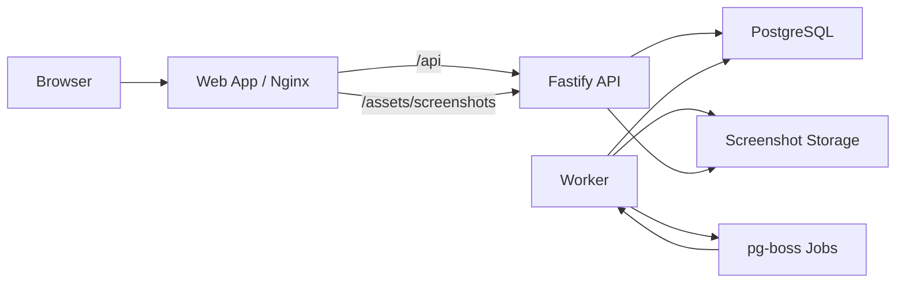
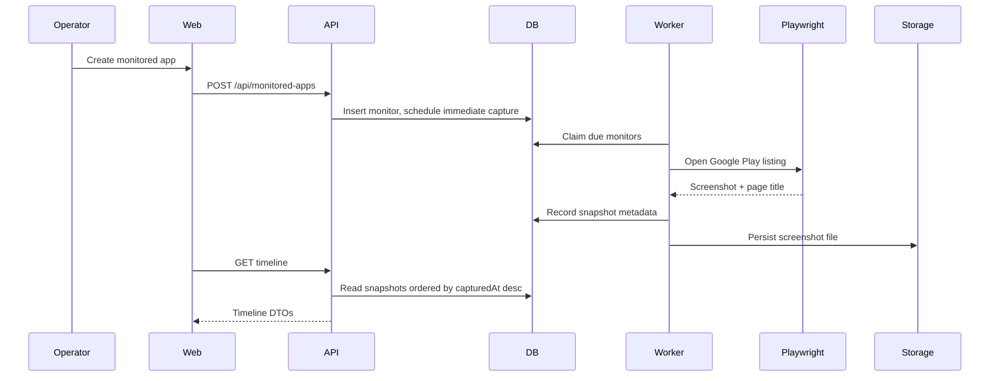

# Architecture

## System Overview

PlayWatch Monitor is split into three runtime services and four shared packages:

| Area             | Path               | Responsibility                                                |
| ---------------- | ------------------ | ------------------------------------------------------------- |
| Web              | `apps/web`         | Operator dashboard                                            |
| API              | `apps/api`         | Validation, CRUD, timeline delivery, screenshot asset serving |
| Worker           | `apps/worker`      | Due-job scheduling and Playwright capture                     |
| Shared contracts | `packages/shared`  | DTOs, schemas, URL normalization                              |
| Config           | `packages/config`  | Typed environment parsing                                     |
| Data layer       | `packages/db`      | Drizzle schema, migrations, repositories                      |
| Storage          | `packages/storage` | Local and cloud-backed screenshot storage drivers             |

## Runtime Topology

## Primary Flow

## Service Contracts

### Web

- Creates and edits monitored apps
- Displays app summary metrics
- Renders timeline filters and screenshots
- Persists theme preference locally

### API

- Normalizes Google Play URLs
- Rejects invalid payloads with typed 4xx responses
- Serves screenshot assets from a fixed prefix
- Exposes health and monitored-app endpoints

### Worker

- Atomically claims due monitors
- Enqueues capture work through `pg-boss`
- Reuses a Playwright browser instance
- Records success, failure, and content hash metadata

## Data Model

| Table            | Purpose                                          | Important fields                                                                                                                    |
| ---------------- | ------------------------------------------------ | ----------------------------------------------------------------------------------------------------------------------------------- |
| `monitored_apps` | Current monitor configuration and schedule state | `package_id`, `region`, `locale`, `capture_frequency_minutes`, `next_capture_at`, `last_attempt_at`, `last_success_at`, `is_active` |
| `app_snapshots`  | Historical capture outcomes                      | `object_key`, `captured_at`, `status`, `content_hash`, `changed_from_previous`, `previous_snapshot_id`, `failure_reason`            |

## Design Decisions

| Decision                              | Reason                                                                                                          |
| ------------------------------------- | --------------------------------------------------------------------------------------------------------------- |
| Drizzle over heavier ORM abstractions | The workload is SQL-first and uses explicit locking and scheduling semantics                                    |
| Storage adapter boundary              | Keeps local development simple while supporting a clean switch to GCS-backed object storage                     |
| Thin API layer                        | Keeps validation and transport concerns close to the edge while leaving data semantics in services/repositories |
| DB-backed scheduler claims            | Prevents duplicate claims across multiple worker instances                                                      |

## Scaling Notes

| Concern            | Current behavior                                   | Future direction                                                                       |
| ------------------ | -------------------------------------------------- | -------------------------------------------------------------------------------------- |
| Multiple workers   | Safe due-job claiming via `FOR UPDATE SKIP LOCKED` | Horizontal worker scale-out                                                            |
| Screenshot storage | Local filesystem or GCS-backed bucket              | Switch drivers through environment config                                              |
| Read traffic       | Single API instance is enough locally              | Increase Cloud Run instance limits or add a dedicated edge tier later if traffic grows |
| Capture throughput | Bounded by `WORKER_CONCURRENCY`                    | Increase concurrency and/or worker replicas                                            |

## Deployment Shape

The checked-in GCP reference deployment keeps the application split intact:

- `apps/web` stays stateless on Cloud Run and proxies the API through explicit upstream scheme, host, and port settings.
- `apps/api` stays stateless on Cloud Run and reaches PostgreSQL over private VPC space.
- `apps/worker` shares a small VM with PostgreSQL so the always-on portion of the system stays cheap and operationally simple.
- Screenshot binaries move out of the VM filesystem and into GCS through the existing storage adapter.
