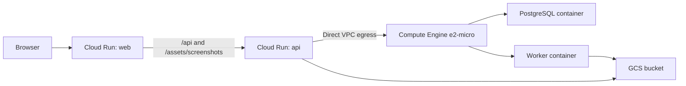

# Cloud Deployment Direction

## Goal

The repository can move from local Docker to a low-cost GCP deployment without changing the service boundaries. The checked-in reference target keeps the stateless web and API processes on Cloud Run, keeps PostgreSQL close to the worker on a single Compute Engine VM, moves screenshot files into GCS, and drives rollout from a single `workflow_dispatch` pipeline.

## Reference GCP Topology

| Application part  | Recommended GCP target             | Notes                                                                                |
| ----------------- | ---------------------------------- | ------------------------------------------------------------------------------------ |
| `apps/web`        | Cloud Run                          | Public browser entrypoint and reverse proxy for `/api` plus `/assets/screenshots`    |
| `apps/api`        | Cloud Run                          | Stateless API process with direct VPC egress into the worker subnet                  |
| `apps/worker`     | Compute Engine `e2-micro` VM       | Runs beside PostgreSQL to avoid an always-on managed worker platform bill            |
| PostgreSQL        | Same Compute Engine VM             | Single-tenant PostgreSQL container, private VPC address, no Cloud SQL                |
| Screenshots       | Cloud Storage                      | The built-in `gcs` storage adapter handles both API reads and worker writes          |
| Deploy automation | GitHub Actions `workflow_dispatch` | Builds images, deploys Cloud Run, runs migrations, and refreshes the VM over IAP SSH |

## Network Layout

The private database path matters because the API still needs PostgreSQL access while remaining stateless. The checked-in deployment scripts create a dedicated serverless subnet and keep PostgreSQL on the VM's internal IP. Cloud Run reaches that address over direct VPC egress, so the database never needs to be exposed to the public internet.

## Release Flow

```mermaid
flowchart LR
  Provision["Provision shared infra"] --> SyncVm["Sync VM runtime bundle"]
  SyncVm --> StartDb["Start PostgreSQL on VM"]
  StartDb --> Migrate["Run migrations in Cloud Run job"]
  Migrate --> DeployApi["Deploy API to Cloud Run"]
  DeployApi --> DeployWeb["Deploy web to Cloud Run with API upstream"]
  DeployWeb --> RefreshApi["Refresh API origin and CORS"]
  RefreshApi --> StartWorker["Start worker on VM"]
```

## What Is Already Ready

| Area                                    | Status                                           |
| --------------------------------------- | ------------------------------------------------ |
| Containerized services                  | Ready                                            |
| Typed environment parsing               | Ready                                            |
| Migration step                          | Ready through a dedicated `migrate` image target |
| Same-origin packaged web delivery       | Ready                                            |
| Screenshot storage abstraction boundary | Ready for local disk and GCS                     |
| GCP deployment assets                   | Ready in `deploy/gcp`                            |
| Workflow-dispatch deployment path       | Ready in `.github/workflows/deploy-gcp.yml`      |

## Cost-Aware Defaults

| Resource                | Default           | Why                                                                            |
| ----------------------- | ----------------- | ------------------------------------------------------------------------------ |
| Region                  | `us-central1`     | Matches the requested footprint and keeps the stack concentrated in one region |
| Worker host             | `e2-micro`        | Keeps the always-on portion of the stack at the smallest practical size        |
| Cloud Run min instances | `0`               | Avoids paying for idle web/API containers                                      |
| Worker concurrency      | `1`               | Keeps memory pressure predictable on the VM                                    |
| Serverless DB path      | Direct VPC egress | Avoids an always-on Serverless VPC Access connector bill                       |
| Screenshot retention    | `30` days         | Keeps GCS costs bounded without changing runtime behavior                      |

## Required GitHub Configuration

Secrets:

| Secret                           | Purpose                                                        |
| -------------------------------- | -------------------------------------------------------------- |
| `GCP_WORKLOAD_IDENTITY_PROVIDER` | GitHub OIDC provider resource for `google-github-actions/auth` |
| `GCP_DEPLOYER_SERVICE_ACCOUNT`   | Deployer service account email                                 |
| `APP_DATABASE_PASSWORD`          | Shared PostgreSQL password                                     |

Variables:

| Variable                           | Purpose                                                |
| ---------------------------------- | ------------------------------------------------------ |
| `GCP_PROJECT_ID`                   | Target GCP project                                     |
| `GCP_REGION`                       | Cloud Run and Artifact Registry region                 |
| `GCP_ZONE`                         | Compute Engine VM zone                                 |
| `GCP_NETWORK`                      | VPC used by Cloud Run direct egress and the VM         |
| `GCP_VM_SUBNET`                    | Subnet used by the worker VM                           |
| `GCP_VM_SUBNET_CIDR`               | CIDR for the VM subnet if bootstrap needs to create it |
| `GCP_SERVERLESS_SUBNET`            | Dedicated subnet for Cloud Run direct VPC egress       |
| `GCP_SERVERLESS_SUBNET_CIDR`       | CIDR reserved for the serverless subnet                |
| `GCP_ARTIFACT_REGISTRY_REPOSITORY` | Docker repository name                                 |
| `GCP_BUCKET_NAME`                  | Screenshot bucket                                      |
| `GCP_BUCKET_LOCATION`              | Screenshot bucket location                             |
| `GCP_BUCKET_RETENTION_DAYS`        | Optional screenshot lifecycle retention window         |
| `GCP_VM_NAME`                      | Worker/PostgreSQL host name                            |
| `GCP_VM_MACHINE_TYPE`              | VM machine type                                        |
| `GCP_VM_TAG`                       | Network tag applied to the VM                          |
| `GCP_API_SERVICE_NAME`             | Cloud Run API service name                             |
| `GCP_WEB_SERVICE_NAME`             | Cloud Run web service name                             |
| `GCP_MIGRATE_JOB_NAME`             | Cloud Run migration job name                           |
| `GCP_API_SERVICE_ACCOUNT`          | Runtime identity for API and migration job             |
| `GCP_WEB_SERVICE_ACCOUNT`          | Runtime identity for web                               |
| `GCP_VM_SERVICE_ACCOUNT`           | Runtime identity attached to the VM                    |
| `APP_DATABASE_NAME`                | PostgreSQL database name                               |
| `APP_DATABASE_USER`                | PostgreSQL application user                            |
| `APP_PG_BOSS_SCHEMA`               | Job schema                                             |
| `APP_GOOGLE_PLAY_DEFAULT_REGION`   | Default region used by captures                        |
| `APP_GOOGLE_PLAY_DEFAULT_LOCALE`   | Default locale used by captures                        |

## Workflow Dispatch Contract

The deployment workflow in [.github/workflows/deploy-gcp.yml](../.github/workflows/deploy-gcp.yml) accepts:

| Input                      | Purpose                                                                                      |
| -------------------------- | -------------------------------------------------------------------------------------------- |
| `environment`              | Chooses the GitHub environment that supplies the secrets and vars                            |
| `bootstrap_infrastructure` | Creates missing Artifact Registry, bucket, service accounts, subnets, firewall rules, and VM |
| `run_quality_gates`        | Runs `pnpm audit --prod` plus `pnpm check` before building images                            |
| `run_migrations`           | Executes the migration job before the release is considered complete                         |

## Deployment Notes

- `API_TRUST_PROXY=true` is part of the Cloud Run deployment defaults.
- Same-origin browser traffic is preserved by the web container proxying to the API Cloud Run URL instead of by an extra load-balancing tier.
- The worker remains stateless apart from PostgreSQL and screenshot storage, which is why the VM can be treated as replaceable infrastructure.
- The same configuration model still maps cleanly to other clouds: replace Cloud Run with another container platform, replace GCS with object storage, and keep the worker next to a small PostgreSQL host.
